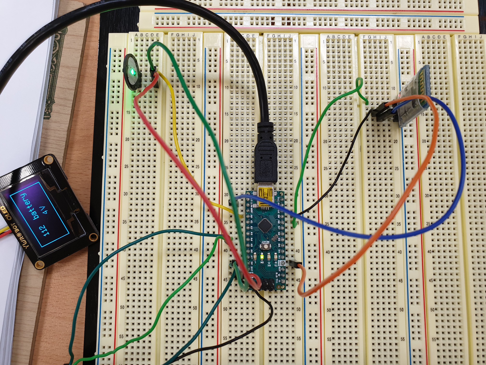
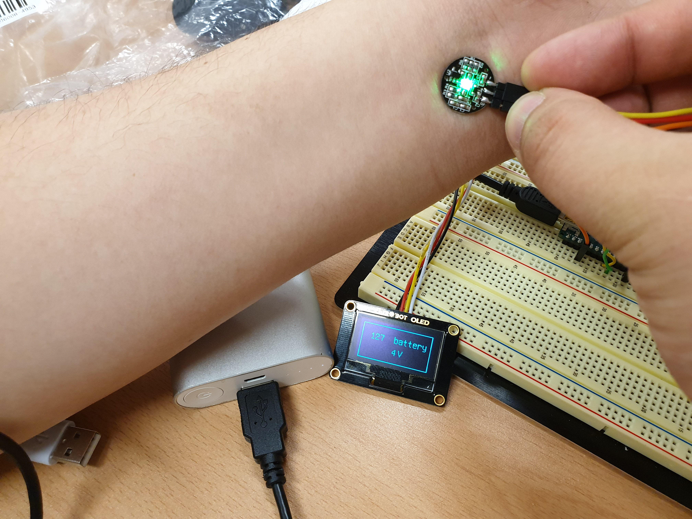
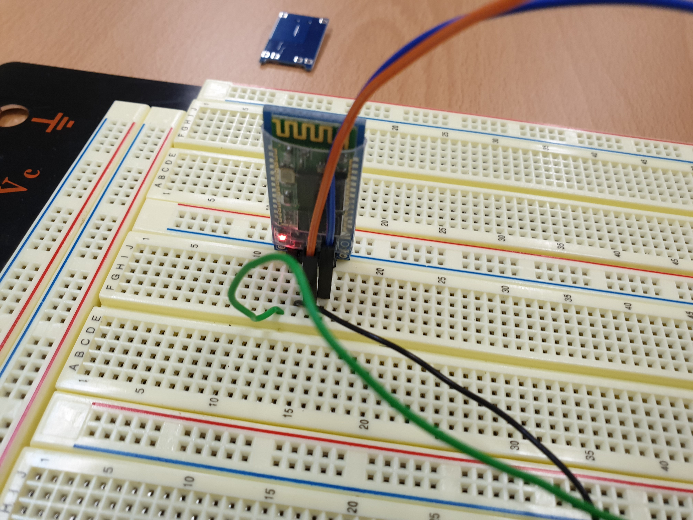

# health_band
腕輪形のディバイスで心拍数を測定します。
非常な心拍数が測定された時はSMSを送ります。

## image

## video
<iframe width="602" height="339" src="https://www.youtube.com/embed/mN8Q9BI3cx0" frameborder="0" allow="accelerometer; autoplay; encrypted-media; gyroscope; picture-in-picture" allowfullscreen></iframe>
